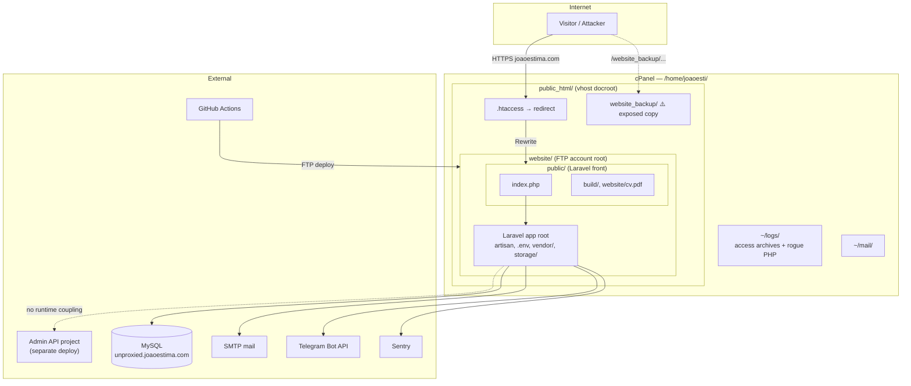
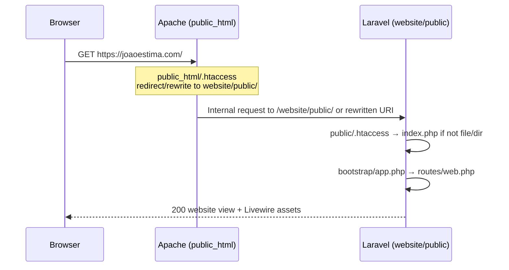
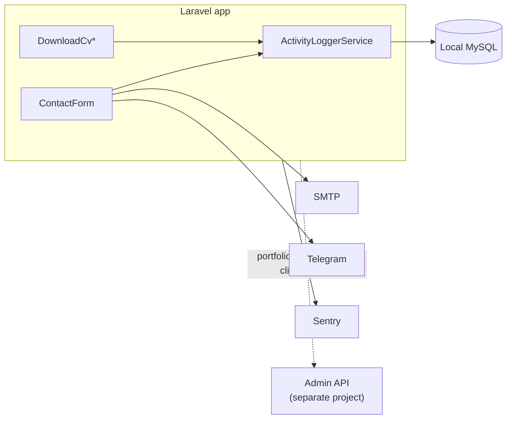

# Architecture — website-livewire

| Field | Value |
|-------|-------|
| **Date** | May 16, 2026 |
| **Project** | website-livewire — portfolio / marketing site for [joaoestima.com](https://joaoestima.com) |
| **Repository** | Laravel 11 + Livewire 3 |
| **Related** | [Security audit](./security-audit.md) |

---

## 1. Purpose & scope

This document describes **how the website-livewire application is built, deployed, stored on disk, and how HTTP traffic reaches Laravel** on shared cPanel hosting. It is intended for:

- Clean reinstall after the May 2026 compromise
- Onboarding and operational decisions (cron, FTP scope, document root)
- Cross-referencing with the [security audit](./security-audit.md) without duplicating every CVE

**In scope:** This repo, its CI/CD pipeline, production layout on `joaoestima.com`, local MySQL usage, and integrations (mail, Telegram, Sentry).

**Out of scope:** The separate **Admin API** project (core business data lives there; this site’s MySQL is for local app state only). Forensic malware analysis of server-side rogue PHP (not in git).

**Production usage (operator-confirmed):** Public homepage only — contact form and CV download. Jetstream `/dashboard` and registration are **not** used in production; `/login` exists but is effectively unused.

---

## 2. System context



---

## 3. Server directory map

cPanel home layout (operator-confirmed). Paths below use the cPanel username **`joaoesti`**.

```
/home/joaoesti/
├── public_html/                          # Main vhost document root (joaoestima.com)
│   ├── .htaccess                         # Redirects ALL traffic → website/public/ (Option A)
│   ├── website/                          # ← FTP account root (= GitHub Actions server-dir "/")
│   │   ├── .env                          # Production secrets (server only, gitignored)
│   │   ├── .deployment-state             # FTP-Deploy-Action state file
│   │   ├── artisan
│   │   ├── vendor/
│   │   ├── storage/                      # logs, cache, sessions (if file), views
│   │   ├── bootstrap/cache/
│   │   ├── app/, config/, routes/, …
│   │   └── public/                       # Laravel web root (intended HTTP entry after redirect)
│   │       ├── index.php
│   │       ├── .htaccess                 # Laravel front controller rules
│   │       ├── build/                    # Vite compiled assets
│   │       └── website/                  # Static CV, images, logos
│   │           └── cv.pdf
│   └── website_backup/                   # ⚠️ Old/extra deploy — web-accessible, NO separate domain
│       └── …                             # https://joaoestima.com/website_backup/...
├── logs/
│   ├── joaoestima.com-May-2026.gz        # Monthly raw access archives
│   ├── ssl_log                           # SSL access log
│   ├── fjtjhyo.php                       # ⚠️ Rogue webshell (Apr 5)
│   └── nclfaeva.php                      # ⚠️ Rogue webshell (Apr 15)
├── mail/                                 # cPanel mail storage
└── …                                     # Other cPanel dirs (tmp, etc.)
```

**Critical hosting constraints:**

| Constraint | Detail |
|------------|--------|
| Vhost docroot | Host **does not** allow pointing `joaoestima.com` directly at `public_html/website/public` |
| Workaround | `public_html/.htaccess` rewrites/redirects requests into `website/public/` |
| FTP scope | FTP user is chrooted to **`public_html/website/`** only — CI `server-dir: "/"` is relative to that root |
| Blast radius | Deploy does **not** write sibling paths under `public_html` (except anything placed there manually, e.g. `website_backup/`) |

---

## 4. Request routing flow

### 4.1 Domain → Laravel



1. **Browser** requests `https://joaoestima.com/...` (document root = `public_html/`).
2. **`public_html/.htaccess`** (server-managed, **not in this git repo**) forwards traffic to **`website/public/`** (operator Option A).
3. **`website/public/.htaccess`** (in repo) sends non-file requests to **`index.php`**:

```17:20:public/.htaccess
    # Send Requests To Front Controller...
    RewriteCond %{REQUEST_FILENAME} !-d
    RewriteCond %{REQUEST_FILENAME} !-f
    RewriteRule ^ index.php [L]
```

4. **`public/index.php`** boots Laravel; **`routes/web.php`** serves the homepage.

### 4.2 URLs that hit Laravel

| URL pattern | Handler | Auth |
|-------------|---------|------|
| `GET /` | `view('website')` | Public |
| `POST /livewire/update` | Livewire v3 | Public (homepage components) |
| `POST /livewire/upload-file` | Livewire (unused by app) | Public |
| `GET /livewire/livewire.js` | Livewire assets | Public |
| `GET /login`, `POST /login`, `POST /logout` | Fortify | Public / auth |
| `GET /dashboard` | Jetstream | Auth + verified |
| `GET /user/profile` | Jetstream | Auth |
| `GET /terms-of-service`, `/privacy-policy` | Jetstream | Public |
| `GET /api/user` | Sanctum | Auth |
| `GET /up` | Health check | Public |
| `GET /storage/{path}` | `storage.local` | Public (Laravel gate) |

**Static files** under `public/website/` and `public/build/` are served by Apache **without** hitting `index.php` when the file exists on disk.

### 4.3 Misconfiguration risk (incident-relevant)

If **`public_html/.htaccess`** is altered to point at a rogue `index.php` at **`public_html/`** root (as in the compromise), traffic **never reaches** Laravel’s `website/public/index.php`. The root `.htaccess` is a **single point of failure** outside git and must be version-controlled or verified after every deploy.

---

## 5. Application stack

Versions from `composer.lock` / `package.json` unless noted.

| Layer | Technology | Version / notes |
|-------|------------|-----------------|
| Runtime | PHP | **^8.3** (`composer.json`); CI uses **8.3** |
| Framework | Laravel | **v11.44.0** |
| UI / reactivity | Livewire | **v3.6.0** — patch to **≥ 3.6.4** before redeploy ([CVE-2025-54068](./security-audit.md)) |
| Auth scaffolding | Laravel Jetstream | **v5.3.5** (Livewire stack) |
| Auth | Laravel Fortify | **v1.25.4** (transitive) |
| API tokens | Laravel Sanctum | **v4.0.8** |
| Error monitoring | sentry/sentry-laravel | **4.13.0** — production only (`bootstrap/app.php`) |
| Notifications | laravel-notification-channels/telegram | **5.0** |
| Frontend build | Vite | **^5.0** |
| CSS | Tailwind CSS | **^3.4** + SCSS (`resources/scss/app.scss`) |
| JS | axios (dev), Alpine via Livewire 3 | `x-data` in `layouts/website.blade.php` |
| CI PHP | shivammathur/setup-php | 8.3 |
| CI Node | actions/setup-node | 20 |

**Fortify features disabled** in `config/fortify.php`: registration, reset passwords, email verification, profile/password updates, 2FA (all commented out).

**Jetstream features** in `config/jetstream.php`: terms/privacy only; API tokens, teams, profile photos, account deletion disabled.

---

## 6. Component map

### 6.1 Routes (application-defined)

```7:23:routes/web.php
Route::get('/', function () {
    return view('website');
});

Route::middleware([
    'auth:sanctum',
    config('jetstream.auth_session'),
    'verified',
])->group(function () {
    Route::get('/dashboard', function () {
        return view('dashboard');
    })->name('dashboard');
});

Route::get('/terms-of-service', [TermsOfServiceController::class, 'show'])->name('terms.show');
Route::get('/privacy-policy', [PrivacyPolicyController::class, 'show'])->name('policy.show');
```

Fortify and Jetstream register additional routes automatically (login, profile, etc.).

### 6.2 Public Livewire components (production surface)

| Component | Class | Embedded in | Actions |
|-----------|-------|-------------|---------|
| Contact form | `App\Livewire\ContactForm` | `components/website/contact.blade.php` | `submit()` → validate, log PII, Telegram + mail, queue confirmation |
| CV section | `App\Livewire\DownloadCv` | `components/website/cv.blade.php` | `downloadCv()` event handler, counter |
| CV button | `App\Livewire\DownloadCvButton` | nested in DownloadCv view | `downloadCv()` → `public/website/cv.pdf` |
| CV counter | `App\Livewire\DownloadCvCounter` | nested | display only (`#[Reactive]`) |

Homepage composition:

```1:8:resources/views/website.blade.php
<x-website-layout>
    <x-website.banner />
    <x-website.about />
    <x-website.projects />
    <x-website.contact />
    <x-website.cv />
    <x-website.footer />
</x-website-layout>
```

Layout: `App\View\Components\WebsiteLayout` → `resources/views/layouts/website.blade.php` (Vite assets, cookie consent, production Google Analytics).

### 6.3 Services & integrations



| Integration | Config / code | Purpose |
|-------------|---------------|---------|
| **Local MySQL** | `.env` `DB_*` — production host **unproxied.joaoestima.com** (operator) | Sessions, cache, queue, users, activity_logs |
| **Admin API** | Separate project; referenced in UI copy only | Core business data; **not** called from this codebase at runtime |
| **SMTP** | `config/mail.php`, `.env` `MAIL_*` | Contact notifications + queued confirmation to submitter |
| **Telegram** | `config/services.php` → `TELEGRAM_BOT_TOKEN`, `TELEGRAM_CHAT_ID` | Instant alert on contact submit |
| **Sentry** | `bootstrap/app.php` when `APP_ENV=production` | Exception reporting |

### 6.4 Scheduled tasks (requires cron)

From `routes/console.php`:

| Command | Schedule | Effect |
|---------|----------|--------|
| `deploy:check` | Every minute | On `.deployment-state` change → migrate, clear caches, optimize |
| `queue:work --stop-when-empty` | Every minute | Processes queued mail (contact confirmations) |

**Required crontab** (typical shared hosting):

```bash
* * * * * cd /home/joaoesti/public_html/website && php artisan schedule:run >> /dev/null 2>&1
```

---

## 7. Data storage

### 7.1 Database (local app MySQL)

| Table | Migration | Purpose |
|-------|-----------|---------|
| `users` | `0001_01_01_000000` | Jetstream users (unused in prod flow) |
| `sessions` | same | Session driver when `SESSION_DRIVER=database` |
| `password_reset_tokens` | same | Fortify (feature disabled) |
| `cache` | `0001_01_01_000001` | `CACHE_STORE=database` |
| `cache_locks` | same | Cache locks |
| `jobs` | `0001_01_01_000002` | `QUEUE_CONNECTION=database` |
| `job_batches`, `failed_jobs` | same | Queue infrastructure |
| `activity_logs` | `2025_01_18_131840` | Contact PII + CV download events |
| `personal_access_tokens` | `2024_11_09_122441` | Sanctum (API feature off in Jetstream) |

**`activity_logs` columns:** `type`, `user_ip`, `user_agent`, `metadata` (JSON — full contact form fields for submissions).

### 7.2 Files on disk

| Path | Content |
|------|---------|
| `storage/logs/laravel.log` | Application log |
| `storage/framework/{cache,sessions,views}` | Framework runtime |
| `storage/app/private` | Local disk root (`FILESYSTEM_DISK=local`, `serve => true`) |
| `public/website/cv.pdf` | CV download (fixed path in `DownloadCvButton`) |
| `public/build/` | Vite manifest + compiled CSS/JS |
| `public/website/img/`, `logos/` | Marketing static assets |

No user uploads are implemented; CV path is hardcoded.

### 7.3 Session & cache config (defaults vs production)

| Setting | `.env.example` | Production (operator `.env.production`) |
|---------|----------------|----------------------------------------|
| `SESSION_DRIVER` | `database` | `database` |
| `SESSION_ENCRYPT` | `false` | `true` |
| `SESSION_SECURE_COOKIE` | unset | enabled |
| `QUEUE_CONNECTION` | `database` | `database` |
| `CACHE_STORE` | `database` | `database` |
| `APP_ENV` | `local` | **`local` (incorrect — should be `production`)** |
| `APP_DEBUG` | `true` | should be `false` |

---

## 8. Deployment architecture

### 8.1 CI → FTP flow

**Workflow:** `.github/workflows/deploy_via_ftp.yml`  
**Trigger:** Push to `main` or `workflow_dispatch`

```mermaid
flowchart TD
    Push[Push to main] --> Checkout[actions/checkout@v3]
    Checkout --> PHP[Setup PHP 8.3]
    PHP --> NPM[npm ci]
    NPM --> Chmod["chmod -R 777<br/>storage bootstrap/cache"]
    Chmod --> Composer["composer install --no-dev"]
    Composer --> Build[npm run build]
    Build --> FTP["SamKirkland/FTP-Deploy-Action<br/>server-dir: /<br/>state: .deployment-state"]
    FTP --> Server["public_html/website/"]
    Server --> Cron{Cron schedule:run?}
    Cron -->|yes| DeployCheck[deploy:check]
    DeployCheck --> Migrate[migrate:check → migrate --force]
```

### 8.2 Deploy mapping

| CI setting | Resolves to on server |
|------------|------------------------|
| `server-dir: "/"` | FTP account root = **`public_html/website/`** |
| Uploaded tree | Full repo: `artisan`, `.env` (if on server), `vendor/`, `storage/`, `public/`, etc. |
| Excluded | `.git*`, `node_modules`, `tests`, dev configs, `README.md`, … |
| **Not** excluded | `.env` on build machine (must never be in repo) |
| State file | `.deployment-state` at app root → triggers `deploy:check` |

### 8.3 Permissions (current vs recommended)

| Path | Current (CI) | Recommended after reinstall |
|------|--------------|------------------------------|
| `storage/` | **777** | **775** (owner/group write; no world write) |
| `bootstrap/cache/` | **777** | **775** |
| Other dirs | — | **755** |
| Files | — | **644** |

The workflow explicitly runs:

```38:44:.github/workflows/deploy_via_ftp.yml
      - name: 📂 Directory Permissions
        run: |
          mkdir -p storage/logs
          mkdir -p storage/framework/cache
          mkdir -p storage/framework/sessions
          mkdir -p storage/framework/views
          chmod -R 777 storage bootstrap/cache
```

---

## 9. Environment & secrets

### 9.1 Where configuration lives

| File | Location | In git? |
|------|----------|---------|
| `.env.example` | Repository | Yes (template only) |
| `.env` | Local dev | No |
| `.env.production` | Server `public_html/website/.env` | No — operator maintains on host only |

### 9.2 Secrets to rotate on clean reinstall

Do **not** commit values; rotate all of:

| Secret | Used for |
|--------|----------|
| `APP_KEY` | Encryption, sessions |
| `DB_*` | Local MySQL |
| `MAIL_*` | SMTP |
| `TELEGRAM_BOT_TOKEN`, `TELEGRAM_CHAT_ID` | Contact alerts |
| `SENTRY_LARAVEL_DSN` | Error reporting |
| GitHub Actions `FTP_SERVER`, `FTP_PRODUCTION_USERNAME`, `FTP_PRODUCTION_PASSWORD` | Deploy pipeline |
| Sanctum / any Jetstream user passwords | If accounts existed on compromised host |

### 9.3 GitHub Actions secrets

Referenced in `.github/workflows/deploy_via_ftp.yml`: `FTP_SERVER`, `FTP_PRODUCTION_USERNAME`, `FTP_PRODUCTION_PASSWORD`.

---

## 10. Logging & observability

| Source | Path / mechanism | Contents |
|--------|------------------|----------|
| **Laravel log** | `storage/logs/laravel.log` | App errors, deploy/migrate messages, Livewire 500s |
| **Sentry** | Production exceptions via `Sentry\Laravel\Integration` | Stack traces, release context |
| **cPanel raw access** | `~/logs/joaoestima.com-*.gz`, `ssl_log` | Every HTTP request to vhost |
| **cPanel error log** | Panel / `error_log` | PHP fatals, mod_security |
| **FTP logs** | Hosting panel | Upload times, brute force |
| **GitHub Actions** | Actions tab | Deploy runs, verbose FTP log |

**Note:** `~/logs/` on this host also contained **rogue PHP webshells** alongside legitimate `.gz` archives — treat log directory as part of wipe scope.

---

## 11. Known production artifacts on server

| Artifact | Location | Risk / action |
|----------|----------|---------------|
| **`.deployment-state`** | `website/` root | Required for `deploy:check`; regenerate on first FTP deploy |
| **`website_backup/`** | `public_html/website_backup/` | **High** — web-accessible old deploy (~390 log hits); active webshells; **delete on wipe** |
| **Root `.htaccess`** | `public_html/.htaccess` | **Critical** — hijacked during incident; must restore redirect to `website/public/` |
| **Rogue PHP** | `public_html/`, `website/public/`, `~/logs/` | `fjtjhyo.php` (Apr 5), `nclfaeva.php` (Apr 15); remove all non-`index.php` PHP under web paths |
| **`.env`** | `website/.env` | Must stay above effective docroot; verify not HTTP-accessible |
| **`vendor/`** | `website/vendor/` | Large; must not be web-readable |

---

## 12. Incident timeline summary

Evidence from operator log review and file timestamps (May 2026 archives span ~30 Apr – 16 May; **no logs for Apr 5–14** in archive).

| Date | Evidence | Interpretation |
|------|----------|----------------|
| **Apr 5** | `fjtjhyo.php` in `~/logs/` | Early webshell placement |
| **Apr 15** | `nclfaeva.php` in `~/logs/` | Second webshell |
| **Apr 30** | `POST /livewire/message` from `54.151.154.70` | Livewire probing (v2-style path or legacy) |
| **May 4** | IP `80.97.160.166` POST **200** to `/website/vendor/.../index.php` and `/website_backup/...` | **Confirmed active webshell use** |
| **May 15** | IP `129.121.87.60` POST `/livewire/update`, `/livewire/upload-file` → 500/508 | Automated Livewire CVE scanner; site broken |
| **May 16** | Security audit + architecture planning | No successful `POST /livewire/update` **200** in May logs |

**Likely chain:** Initial access (Livewire RCE [CVE-2025-54068](./security-audit.md), FTP, or mis-set docroot) → webshells in `website/`, `website_backup/`, and `logs/` → root `.htaccess` pointed to attacker `index.php` at `public_html` instead of `website/public/`.

---

## 13. Target architecture after clean reinstall

Use this checklist when rebuilding on wiped `public_html` + `logs/` (+ optional DB wipe).

### Host & filesystem

- [ ] Wipe **all** of `public_html/` and rogue `~/logs/*.php`; delete **`website_backup/`** entirely
- [ ] Restore **`public_html/.htaccess`** to redirect only to **`website/public/`** (store canonical copy in git or runbook)
- [ ] Confirm FTP account remains scoped to **`public_html/website/`** only
- [ ] Directory perms **755/644**, `storage` + `bootstrap/cache` **775** (not 777)
- [ ] Verify `curl -I https://joaoestima.com/.env` and `/vendor/` return 403/404

### Application & dependencies

- [ ] `composer update livewire/livewire` → **≥ 3.6.4**
- [ ] `composer update laravel/framework` → **≥ 11.44.1**; run `composer audit`
- [ ] Set **`APP_ENV=production`**, **`APP_DEBUG=false`**
- [ ] Keep `SESSION_ENCRYPT=true`, `SESSION_SECURE_COOKIE=true` on HTTPS
- [ ] Add contact form rate limiting; consider removing unused `/login` + Jetstream routes

### CI/CD

- [ ] Remove `chmod -R 777` from `.github/workflows/deploy_via_ftp.yml`; use **775** or let host default apply post-deploy
- [ ] Rotate GitHub FTP secrets; review Actions access logs
- [ ] Consider SFTP/SSH deploy or artifact that minimizes uploaded surface

### Operations

- [ ] Fresh `.env` on server; rotate all secrets (see §9.2)
- [ ] Configure cron: `php artisan schedule:run` every minute
- [ ] Run migrations manually on first deploy; consider disabling `migrate --force` from `deploy:check`
- [ ] Re-enable Sentry with new DSN
- [ ] Post-deploy: scan `public/` for unexpected `.php`; monitor `POST /livewire/update`

### Security posture (summary)

Top risks are documented in [security-audit.md](./security-audit.md): **Livewire RCE**, **FTP full-tree deploy + 777**, **root `.htaccess` hijack**, **`website_backup` exposure**. This document’s disk layout and routing sections exist to prevent repeating those failure modes.

---

## 14. References

| Document | Description |
|----------|-------------|
| [docs/plan/security-audit.md](./security-audit.md) | Full CVE table, attack surface, remediation checklist |
| [docs/plan/reinstall-runbook.md](./reinstall-runbook.md) | Step-by-step wipe, deploy, and YOU/ME task split |
| [CVE-2025-54068](https://github.com/advisories/GHSA-29cq-5w36-x7w3) | Livewire RCE |
| `.github/workflows/deploy_via_ftp.yml` | Production deploy pipeline |
| [SamKirkland/FTP-Deploy-Action](https://github.com/SamKirkland/FTP-Deploy-Action) | `server-dir` relative to FTP home |

---

*Re-run `composer audit` and `php artisan route:list` after dependency or route changes. Update this document if hosting layout or deploy path changes.*
